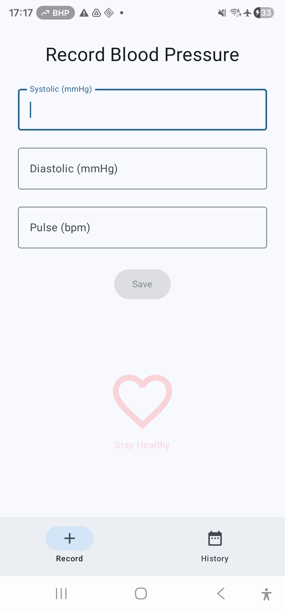
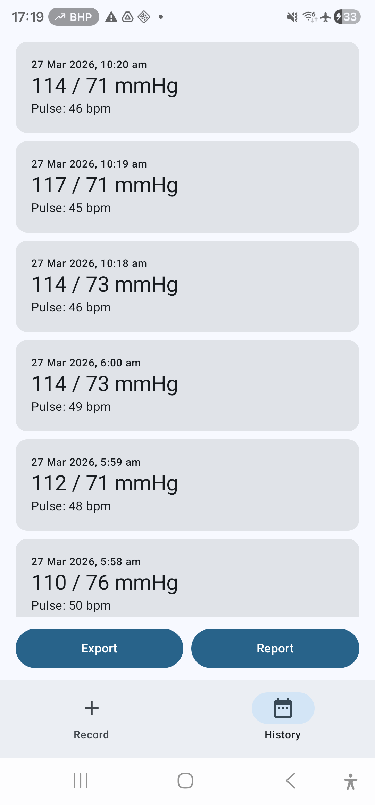

# Blood Pressure Tracker

An Android app for manually recording blood pressure readings with timestamps, viewing history, and exporting data for sharing with healthcare providers.

THE BEST WAY TO INSTALL THIS APP IS TO CLONE THIS REPO INTO A PROJECT DIRECTORY OF ANDROID STUDIO RUNNING ON A WINDOWS PC. USE CLAUDE CODE TO MAKE ANY CHANGES OR TO GET HELP TO RUN IT ON YOUR PHONE.

## Screens

### Record Screen


- Enter **systolic** (mmHg), **diastolic** (mmHg), and optionally **pulse** (bpm)
- Numeric-only keyboard input with digit filtering
- Save button enables only when systolic and diastolic are filled in
- Pulse can be left blank (stored as 0)
- Fields clear and keyboard dismisses after saving
- Snackbar confirms each saved reading
- Subtle heart graphic with "Stay Healthy" message below the form

### History Screen


- Scrollable list of all readings, newest first
- Each card displays formatted date/time, blood pressure (e.g. "120 / 80 mmHg"), and pulse (or "NA" if not recorded)
- Tap any record to delete it (with confirmation dialog)
- Empty state shown when no records exist

## Data Export & Import

Four options are available at the bottom of the History screen:

### Export (Standard CSV)
One record per row, oldest first, with headers:
```
Date/Time,Systolic (mmHg),Diastolic (mmHg),Pulse (bpm)
2026-03-25 18:00:00,130,85,68
2026-03-26 08:15:00,118,78,NA
2026-03-26 14:30:00,120,80,72
```

### Report (Grouped CSV)
Records grouped by date, oldest first, up to 3 per row, with aligned columns for readability:
```
25 Mar 2026," 6:00pm 130 / 85 / 68",,
26 Mar 2026," 8:15am 118 / 78"," 2:30pm 120 / 80 / 72",
```

### Averages (Daily Average CSV)
One row per date with averaged values, oldest first:
```
Date,Systolic (mmHg),Diastolic (mmHg),Pulse (bpm)
25 Mar 2026,130,85,68
26 Mar 2026,119,79,72
```
Pulse shows "NA" if no readings for that date had a pulse recorded.

### Import (CSV)
Import a previously exported CSV file to restore or transfer readings. Opens a file picker for `text/*` files. Parses the standard CSV format (with headers) and **replaces all existing records** with the imported data after a confirmation dialog. The Import button is available even when the history is empty.

## Tech Stack

| Component | Technology |
|-----------|-----------|
| Language | Kotlin 2.0.21 |
| UI | Jetpack Compose, Material Design 3 |
| Database | Room 2.7.1 (SQLite) |
| Architecture | Single Activity, state-based navigation |
| Min SDK | 36 |
| Build | Gradle 9.1.0, AGP 9.0.1 |

## Building

```bash
./gradlew assembleDebug
```

Or open in Android Studio and run with Shift+F10.

## Database

Records are stored locally in `blood_pressure.db` at:
```
/data/data/au.roman.bloodpressuretracker/databases/blood_pressure.db
```

Inspect live via Android Studio's **View > Tool Windows > App Inspection > Database Inspector**.

## License

GPL-3.0
